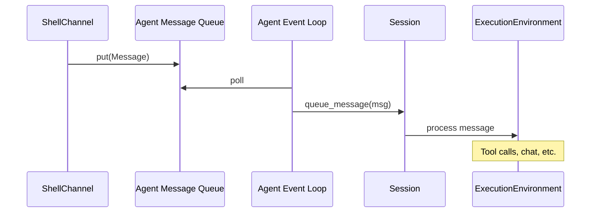
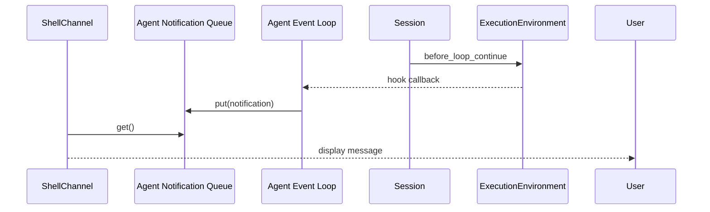

# Agent Architecture Design

## Overview

The Agent is the central hub that manages concurrent sessions and channels with full decoupling. It maintains its own event loop running in a background thread, processing messages from channels and routing them to sessions. Session responses are published via hook notifications to subscribed channels.

## Core Principles

### 1. Single Responsibility

Each component has one clear responsibility:

- **Agent**: Message routing and event loop management
- **Session**: Message processing and chat execution
- **Channel**: User interaction interface (shell, REST, etc.)
- **ExecutionEnvironment**: Session-specific execution logic

### 2. Clear Boundaries

Components communicate only through well-defined interfaces:

- Channels post to Agent's message queues
- Agent processes messages and triggers session execution
- Sessions trigger hooks that publish to notification queues
- Channels consume from their notification queues

### 3. No Blocking

- Channels never block sessions
- Sessions never block other channels
- All inter-component communication is non-blocking via queues

### 4. Thread Isolation

- Agent's event loop runs in a dedicated background thread
- Each Agent instance is completely isolated
- No shared state between Agent instances

### 5. Testability

- Each component can be tested independently with mocks
- Queues are injectable for testing
- Event loop lifecycle is explicit (start/stop)
- Concurrency is controlled via queue semantics, not threads

## Architecture

### Component Diagram

```
+------------------+     +------------------+     +------------------+
|   ShellChannel   |---->|                  |     |  RESTApiChannel  |
+------------------+     |                  |<----+------------------+
                         |                  |
+------------------+     |      AGENT       |     +------------------+
|   REST API       |---->|                  |---->|  WebSocket       |
+------------------+     |                  |     +------------------+
                         |                  |
                         +--------+---------+
                                  |
                        +---------v----------+
                        |  Message Queues    |
                        | (per session)      |
                        +---------+----------+
                                  |
                        +---------v----------+
                        |  Notification      |
                        |  Queues            |
                        | (per channel/      |
                        |   session pair)    |
                        +---------+----------+
                                  |
                        +---------v----------+
                        |  Event Loop        |
                        |  (background task) |
                        +---------+----------+
                                  |
                        +---------v----------+
                        |  Session Manager   |
                        +---------+----------+
                                  |
                        +---------v----------+
                        |  Sessions          |
                        |  (per UUID)        |
                        +---------+----------+
                                  |
                        +---------v----------+
                        | ExecutionEnv       |
                        | Hook Notifications |
                        +--------------------+
```

### Data Flow

#### Incoming Messages (Channel -> Session)



#### Outgoing Messages (Session -> Channel)



## Class Design

### Agent

**Responsibility**: Central message routing hub with its own event loop.

**Key Design Decisions**:

1. **Event loop in background thread**: Prevents blocking user input from blocking session processing
2. **Per-session message queues**: Enables concurrent message handling
3. **Per-channel notification queues**: Enables independent channel processing
4. **Explicit lifecycle**: `start()` and `stop()` methods for clean management

```python
class Agent:
    # State management
    _message_queues: Dict[UUID, asyncio.Queue]
    _notification_queues: Dict[Tuple[str, UUID], asyncio.Queue]
    _loop_task: Optional[asyncio.Task]
    _running: bool

    # Session management
    _sessions: Dict[UUID, Session]
    _session_channels: Dict[UUID, Set[Channel]]

    # Lifecycle
    async def start() -> None
    async def stop() -> None
    async def _main_loop() -> None

    # Message routing
    def post_message(session_uuid: UUID, message: Message) -> None
    def subscribe_notifications(channel_name: str, session_uuid: UUID) -> AsyncIterator[str]

    # Session management
    def create_session(role_name: str) -> Session
    def get_session(session_uuid: UUID) -> Optional[Session]
    def destroy_session(session_uuid: UUID) -> bool
```

### Channel

**Responsibility**: User-facing interface for sending/receiving messages.

**Key Design Decisions**:

1. **Base class with abstract methods**: Ensures all channels follow same interface
2. **Agent reference for posting**: Channels post messages to agent's queues
3. **Notification subscription**: Channels subscribe to their session's notification queue
4. **Independent running state**: Each channel manages its own lifecycle

```python
class Channel:
    # State
    name: str
    _agent: Agent
    _running: bool

    # Posting
    def send_message_to_session(session_uuid: UUID, content: str) -> None

    # Receiving (async for streaming channels)
    async def receive_notifications(session_uuid: UUID) -> AsyncIterator[str]

    # Lifecycle
    def start() -> None
    def stop() -> None
```

### Session

**Responsibility**: Message processing and chat execution.

**Key Design Decisions**:

1. **No direct channel access**: Sessions don't know about channels
2. **Hook-based notifications**: Sessions publish via hooks, Agent routes to channels
3. **Thread-safe queue**: `queue_message()` uses lock for concurrent access

```python
class Session:
    # State
    uuid: UUID
    role: Role
    chat_history: ChatHistory
    execution_environment: ExecutionEnvironment
    _message_queue: deque[Message]

    # Message processing
    async def queue_message(message: Message) -> None
```

### ExecutionEnvironment

**Responsibility**: Session-specific execution logic (tool calls, chat, loops).

**Key Design Decisions**:

1. **Hook system**: All observable events fire hooks
2. **No channel knowledge**: ExecutionEnvironment doesn't know about channels
3. **Deterministic flow**: Clear state machine for execution

```python
class ExecutionEnvironment:
    # Hook points
    register_hook(hook_point: str, callback: Callable)

    # Hooks fired during execution
    # - before_tool_execution
    # - after_tool_execution
    # - before_loop_continue
    # - before_loop_exit
```

## Threading Model

### Event Loop Thread

```
+------------------+
| Agent Thread     |
|                  |
| +--------------+ |
| | Event Loop   | |
| | +----------+ | |
| | | Poll     | | |
| | | Message  | | |
| | | Queues   | | |
| | +----------+ | |
| | +----------+ | |
| | | Process  | | |
| | | Sessions | | |
| | +----------+ | |
| | +----------+ | |
| | | Notify   | | |
| | | Channels | | |
| | +----------+ | |
| +--------------+ |
+------------------+
```

### Channel Threads

```
+-------------+  +-------------+  +-------------+
| ShellThread |  | RESTThread  |  | WebSocket   |
|             |  |             |  | Thread(s)   |
| +---------+ |  | +---------+ |  | +---------+ |
| | input() | |  | | HTTP    | |  | | WS      | |
| |         | |  | | handler | |  | | handler | |
| +---------+ |  | +---------+ |  | +---------+ |
+-------------+  +-------------+  +-------------+
       |                  |                  |
       v                  v                  v
    +------------------------------------------------+
    |                 Agent (shared)                 |
    +------------------------------------------------+
```

## Message Queue Semantics

### Message Queue (per session)

- **Type**: `asyncio.Queue`
- **Producer**: Channels (via `post_message()`)
- **Consumer**: Agent's `_main_loop()`
- **Behavior**: First-in-first-out, non-blocking put/get

### Notification Queue (per channel/session)

- **Type**: `asyncio.Queue`
- **Producer**: Agent's `_main_loop()` (via hooks)
- **Consumer**: Channel (via `receive_notifications()`)
- **Behavior**: First-in-first-out, non-blocking put/get

## Concurrency Guarantees

### What's Guaranteed

1. **Message ordering per session**: Messages to the same session are processed in order
2. **Notification ordering per channel/session**: Notifications arrive in order
3. **No race conditions**: Queue semantics ensure safe concurrent access
4. **Clean shutdown**: `stop()` waits for pending operations

### What's Not Guaranteed

1. **Message ordering across sessions**: Different sessions may process concurrently
2. **Latency**: No guaranteed delivery time (useful for batch, not real-time)
3. **At-least-once delivery**: Notifications may be lost if channel disconnects

## Testing Strategy

### Unit Tests

Each component tested independently:

1. **Agent Tests**:
   - `test_message_queue_creation`: Verify queues created per session
   - `test_message_routing`: Verify messages routed to correct session
   - `test_hook_notification`: Verify hooks publish to notification queues
   - `test_lifecycle`: Verify start/stop behavior

2. **Session Tests**:
   - `test_queue_message`: Verify message added to queue
   - `test_execution_loop`: Verify execution environment processes messages

3. **Channel Tests**:
   - `test_post_message`: Verify message posted to agent
   - `test_notification_consume`: Verify notifications received

### Integration Tests

Test component interactions:

1. **Shell to Session Flow**:
   ```python
   async def test_shell_to_session_flow():
       agent = Agent()
       shell = ShellChannel("test", agent)
       session = agent.create_session("test")

       await agent.start()
       await shell.start()

       shell.post_message(session.uuid, "hello")
       notification = await shell.receive_notification(session.uuid)

       assert "hello" in notification
   ```

2. **Concurrent Channels**:
   ```python
   async def test_concurrent_channels():
       agent = Agent()
       shell1 = ShellChannel("shell1", agent)
       shell2 = ShellChannel("shell2", agent)
       session = agent.create_session("test")

       await agent.start()
       await shell1.start()
       await shell2.start()

       shell1.post_message(session.uuid, "msg1")
       msg1 = await shell1.receive_notification(session.uuid)

       shell2.post_message(session.uuid, "msg2")
       msg2 = await shell2.receive_notification(session.uuid)

       # Both should see their messages
       assert msg1 is not None
       assert msg2 is not None
   ```

### Concurrency Testing

Use `pytest-asyncio` and `anyio` for async testing:

1. **Race condition detection**: Run tests multiple times
2. **Stress testing**: Create many sessions/channels concurrently
3. **Deadline testing**: Verify timeout handling

```python
@pytest.mark.asyncio
async def test_concurrent_post_messages():
    agent = Agent()
    session = agent.create_session("test")
    await agent.start()

    async def post_many():
        for i in range(100):
            agent.post_message(session.uuid, Message(content={"role": "user", "content": f"msg{i}"}))

    await asyncio.gather(*[post_many() for _ in range(10)])

    # Verify all messages processed
    assert len(session.chat_history.messages) >= 100
```

## Design Trade-offs

### Queues vs Direct Callbacks

**Choice**: Use queues instead of direct callbacks

**Rationale**:
- Decouples producers from consumers
- Enables buffering during high load
- Simplifies error handling (queue can hold failed messages)
- Easier to test (queues are mockable)

### Background Thread vs Main Thread

**Choice**: Run event loop in background thread

**Rationale**:
- Prevents blocking user input
- Enables clean separation of concerns
- Allows multiple channel types (sync shell, async REST)

**Alternative**: Run everything in main thread
- Pros: Simpler threading model
- Cons: Blocking operations block everything

### Per-Session vs Global Queues

**Choice**: Per-session message queues

**Rationale**:
- Enables concurrent processing of different sessions
- Message ordering preserved per session
- Easier to implement fair scheduling

**Alternative**: Single global queue
- Pros: Simpler implementation
- Cons: One busy session blocks all others

## Future Extensions

### Persistence

- Store messages in queue for crash recovery
- Serialize notification queues to disk
- Periodic checkpoint of session state

### Rate Limiting

- Add token bucket per session
- Backpressure on message queues
- Configurable limits per channel type

### Priority Queues

- Priority ordering for urgent messages
- QoS levels for different message types
- Fair scheduling across sessions

### Multi-Agent Coordination

- Message bus between agents
- Session migration between agents
- Load balancing across agents
