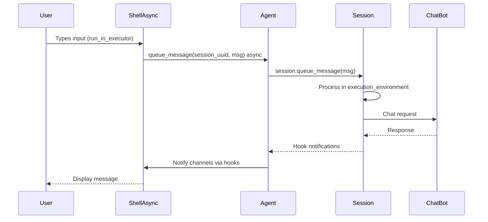
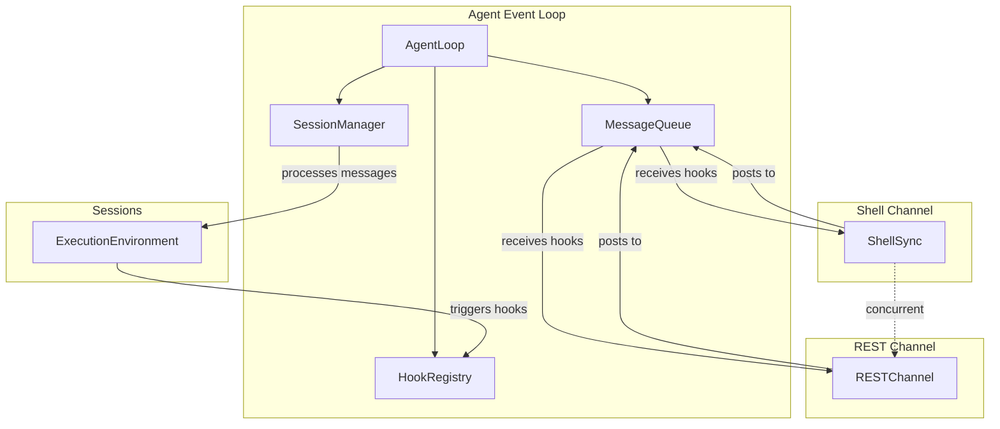
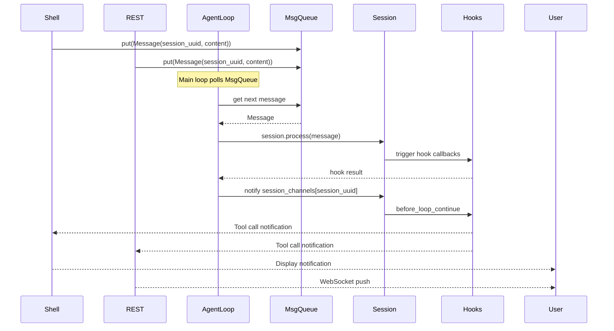

# Channel Architecture Options - Temporary Comparison

This document compares architectural options for the Agent Channel System.

## Option 1: Async Shell Channel

### Data Flow Diagram



### Pros
- Clean separation: shell is async, matches session design
- No blocking: `run_in_executor` keeps REPL feel without blocking event loop
- Simple to understand: async flows through all layers

### Cons
- Requires learning async patterns
- `run_in_executor` adds slight overhead
- Shell's `receive()` must become `async def receive()`

### Concurrency
- Shell runs concurrently with sessions in same event loop
- Multiple channels on same session: all receive hooks concurrently via `session_channels` dict
- **If shell does blocking I/O: blocks entire event loop** (bad for other channels/sessions)

### Multi-Agent
- Each Agent has its own event loop
- No cross-agent interference

---

## Option 3: Event Loop Manager in Agent

### High-Level Architecture



### Detailed Data Flow



### Queue Structure

```python
class Agent:
    def __init__(self, ...):
        self._message_queues: Dict[UUID, asyncio.Queue] = {}  # per-session queues
        self._notification_queues: Dict[Tuple[str, UUID], asyncio.Queue] = {}
        self._loop_task: Optional[Task] = None
        self._running = False
    
    async def start_loop(self):
        """Start the agent's event loop in background thread."""
        self._running = True
        self._loop_task = asyncio.create_task(self._main_loop())
    
    async def _main_loop(self):
        while self._running:
            # Poll all queues for messages
            for session_uuid, queue in self._message_queues.items():
                if not queue.empty():
                    msg = queue.get_nowait()
                    await self._sessions[session_uuid].queue_message(msg)
            
            # Process hook notifications
            await asyncio.sleep(0.01)  # prevent busy wait
```

### Channel Integration

```python
class ShellChannel:
    def send_message_to_agent(self, session_uuid: UUID, content: str):
        """Post message to agent's queue for this session."""
        queue = self._agent._message_queues[session_uuid]
        queue.put_nowait(Message(content={"role": "user", "content": content}))
    
    def receive_from_agent(self, session_uuid: UUID) -> AsyncIterator[str]:
        """Yield notifications from hooks."""
        notif_queue = self._agent._notification_queues[(self.name, session_uuid)]
        while self._running:
            msg = await notif_queue.get()
            yield msg
```

### Pros
- Agent has full control over message flow
- True decoupling: channels never know if session is busy
- Easy to extend: add rate limiting, batching, priority queues
- Shell stays synchronous: simple `input()`
- REST channel can be async-friendly with WebSocket

### Cons
- Most complex architecture
- Agent manages threading + queues + event loop
- Harder to test and debug
- More code, more potential for bugs

### Concurrency
- Agent event loop runs in background thread
- Channels post messages to queues (non-blocking)
- Channels receive notifications via their own queues
- **No blocking**: channels can block without affecting sessions
- Multiple channels: truly concurrent, all share same message flow

### Multi-Agent
- Each Agent = independent process/thread with its own loop
- Complete isolation: no shared state
- Scales horizontally: more agents = more resources

---

## Comparison Summary

| Aspect | Option 1 (Async Shell) | Option 3 (Agent Loop) |
|--------|----------------------|---------------------|
| Shell complexity | Low (async/await) | Low (sync input()) |
| Agent complexity | Low | High (queues, threads) |
| Concurrency | Shared loop (one blocks all) | Isolated (true parallel) |
| Multi-agent | Separate loops | Separate threads/loops |
| Extensibility | Good | Excellent |
| Debugging | Easy | Harder |
| Blocking risk | High (shell blocks everything) | None (isolated threads) |

## Recommendation

**For your use case (multiple agents, future REST channel, concurrency concerns):**

**Option 3 (Event Loop Manager)** is the most future-proof because:
1. **True decoupling**: Channels never block sessions
2. **Multi-agent ready**: Each agent is self-contained
3. **Extensible**: Easy to add features (rate limiting, persistence, scaling)
4. **Shell stays simple**: `input()` works without async complexity
5. **REST channel natural**: WebSocket pushes fit the queue-based notification model

**Trade-off:** More initial complexity, but pays off in maintainability and extensibility.
