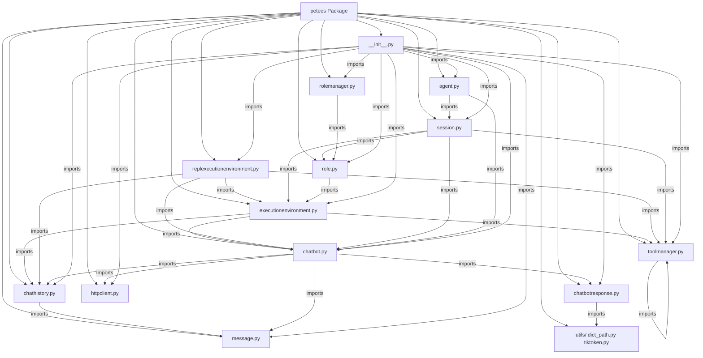

# Peteos Architecture

## Overview

Project includes Message, ChatHistory, Tool, ToolManager, ExecutionEnvironment, REPLExecutionEnvironment, Session, Role, RoleManager, Agent, HTTPClient, ChatBot (abstract), ChatBotResponse (abstract), GenericChatBot, OpenAIChatBot, AnthropicChatBot, GenericChatBotResponse, AnthropicChatBotResponse classes.

For complete class definitions and diagrams, see [classes.md](classes.md).

## Structure

```
peteos/
├── __init__.py
├── agent.py
├── chatbot.py
├── chatbotresponse.py
├── message.py
├── chathistory.py
├── toolmanager.py
├── executionenvironment.py
├── httpclient.py
├── replexecutionenvironment.py
├── session.py
├── role.py
├── rolemanager.py
└── utils/
    ├── __init__.py
    ├── dict_path.py
    └── tiktoken.py
```

For complete class definitions and descriptions, see [classes.md](classes.md).

## Utilities

### get_value_at_path (peteos/utils/dict_path.py)

Utility function for extracting values from nested dictionaries using path notation.

**Signature:**
```python
get_value_at_path(data: dict, path: str, type_discriminator: bool = True) -> any
```

**Path Notation Support:**

| Notation | Description | Example |
|----------|-------------|---------|
| Simple key | Direct key access | `"field"` -> `data["field"]` |
| Array index | Specific array element | `"choices[0]"` -> `data["choices"][0]` |
| Wildcard | Iterate all array elements | `"choices[*].delta.content"` -> `["text1", "text2"]` |
| Type discriminator | Match `type` field, then navigate | `"content_block_start.content_block.text"` |

**Examples:**

```python
# Simple key access
get_value_at_path({"name": "Alice"}, "name")
# Returns: "Alice"

# Specific array index
get_value_at_path({"choices": [{"delta": {"content": "Hello"}}]}, "choices[0].delta.content")
# Returns: "Hello"

# Wildcard - returns list of all matching values
event = {"choices": [
    {"delta": {"content": "Hello"}},
    {"delta": {"content": "world"}}
]}
get_value_at_path(event, "choices[*].delta.content")
# Returns: ["Hello", "world"]

# Type discriminator - matches `type` field value to navigate
event = {"type": "content_block_start", "content_block": {"text": "hi"}}
get_value_at_path(event, "content_block_start.content_block.text")
# Returns: "hi"
# (matches type="content_block_start", then accesses content_block.text)
```

**How Type Discriminator Works:**

When the first path component doesn't exist as a key but matches the `type` field value, the function stays in the current dictionary and continues with the remaining path:

```python
event = {
    "type": "message_start",
    "message": {"role": "assistant", "content": []}
}

# Without type discriminator - would fail because "message_start" is not a key
get_value_at_path(event, "message_start.message.role", type_discriminator=False)
# Returns: None

# With type discriminator - matches type="message_start", then navigates to message.role
get_value_at_path(event, "message_start.message.role", type_discriminator=True)
# Returns: "assistant"
```

## Dependencies

- Python >= 3.10
- `httpx` - async HTTP client
- `pytest`, `pytest-asyncio`, `aiohttp` - dev dependencies for testing
- `tiktoken` (optional) - token counting, install with `pip install peteos[tiktoken]`

## Key Implementation Details

### Streaming Behavior

#### Response Accumulation

The `ChatBotResponse` accumulates ALL response fields into `response.data` dict as events are processed:

```python
response = await chatbot.send_message(history)
async for key, chunk in response:
    # Each iteration updates response.data[key]
    pass

# After iteration:
response.data["text"]       # Fully accumulated text
response.data["reasoning"]  # Fully accumulated reasoning
response.data["tool_calls"] # List of tool calls
```

#### Async Iteration Yields (key, chunk) Pairs

Each iteration yields a single **(key, chunk)** tuple:
- `key`: The field name (e.g., "text", "reasoning")
- `chunk`: The actual delta value (not accumulated)

```python
# Simple streaming - yields one tuple per field update
async for key, chunk in response:
    if key == "text":
        print(chunk, end="")  # "H", "e", "l", "l", "o"

# Multi-field event - yields multiple tuples sequentially
# Event: {"type": "message_start", "message": {"text": "...", "reasoning": "R"}}
# Yields: ("text", "..."), ("reasoning", "R")
```

**Key Points:**
- `chunk` is the **delta**, not the accumulated value
- `response.data[key]` contains the **accumulated** value
- Multiple fields from same event are yielded sequentially
- All fields are accumulated even if not iterated

### Error Handling

#### Tool Execution Exceptions

Tool execution exceptions are caught and recorded in the tool result message:

```python
try:
    result = tool.execute(**args)
    # Success: append with success=True
except Exception as e:
    # Failure: append error message with success=False
    Message(content={
        "role": "tool",
        "name": tool_name,
        "content": f"Error: {type(e).__name__}: {str(e)}",
        "success": False
    })
```

#### Missing Tool Handling

If a tool is not found in the ToolManager, an error message is appended:

```python
tool = self.tool_manager.get_tool(tool_name)
if tool:
    # Execute tool
else:
    # Tool not found error
    Message(content={
        "role": "tool",
        "name": tool_name,
        "content": f"Error: Tool '{tool_name}' not found",
        "success": False
    })
```

#### Network Errors

HTTPClient uses `httpx.AsyncClient` with timeout. Errors include:
- Connection errors (timeout, refused connection)
- HTTP errors (4xx, 5xx responses)
- JSON parse errors (malformed responses)

These propagate as `httpx` exceptions to the caller. The `timeout` parameter (default: 60s) controls request timeout.

### Thread Safety

#### Interrupt Flag

The `_interrupt` flag in `ExecutionEnvironment` is **thread-safe** for the basic boolean operations used:
- `set_interrupt()`: Sets `_interrupt = True`
- `clear_interrupt()`: Sets `_interrupt = False`

However, there are no locks - this relies on Python's GIL for atomic boolean assignment. For production use with heavy threading, consider using `threading.Event`.

#### Session/Agent Concurrency

**Important:** The `Agent` class is documented as managing concurrent sessions with threads, but the current implementation is a **stub**:
- `_sessions` and `_channels` are plain dicts
- No threading is implemented
- No actual session management exists

To use concurrent sessions, you would need to implement threading in the `Agent` class.

### Anthropic API Differences

#### Request Format

Anthropic API requires:
- `max_tokens` in every request (added automatically by `_build_body()`)
- `**kwargs` in `send_message()` merge into request body
- System prompt extracted separately from user messages

#### Response Format Differences

| Mode | Response Structure | Role Field |
|------|-------------------|------------|
| Streaming | Events via SSE (`message_start`, `content_block_*`) | In `message_start.message.role` |
| Non-streaming | Top-level JSON (`{"role": "assistant", "content": [...]}`) | At top level |

Non-compliant backends may omit the role field. `AnthropicChatBotResponse` defaults to `'assistant'` in this case.

## Component Diagram


