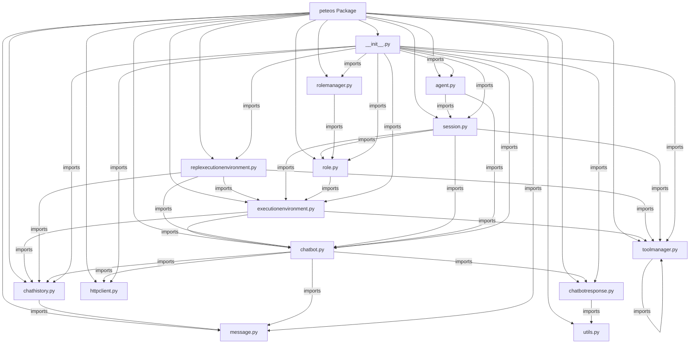

# Peteos Architecture

## Overview

Project includes Message, ChatHistory, Tool, ToolManager, ExecutionEnvironment, REPLExecutionEnvironment, Session, Role, RoleManager, Agent, HTTPClient, ChatBot (abstract), ChatBotResponse (abstract), GenericChatBot, OpenAIChatBot, AnthropicChatBot, GenericChatBotResponse, AnthropicChatBotResponse classes.

## Structure

```
peteos/
├── __init__.py
├── agent.py
├── chatbot.py
├── chatbotresponse.py
├── message.py
├── chathistory.py
├── toolmanager.py
├── executionenvironment.py
├── httpclient.py
├── replexecutionenvironment.py
├── session.py
├── role.py
├── rolemanager.py
└── utils.py
```

## Components

### Message

Represents a single immutable message with content and timestamp.

**Attributes:**
- `content` (dict): Dictionary containing the message content. Example: `{"role": "user", "content": "Hello"}`
- `creation_timestamp` (datetime): Timestamp of message creation (defaults to now)
- `id` (str): UUID identifying this message (auto-generated if not provided)

**Example:**
```python
# Simple message
Message(content={"role": "user", "content": "Hello"})

# Multi-part content
Message(content={"role": "assistant", "content": [{"type": "text", "text": "..."}]})
```

### ChatHistory

Container for chat messages.

**Attributes:**
- `messages` (List[Message]): List of Message objects

**Methods:**
- `get_content()` -> List[dict]: Returns list of all message content dictionaries
- `append_message(message: Message)`: Appends message to history

### Tool

Represents a tool with its properties.

**Attributes:**
- `name` (str): The name of the tool
- `description` (str): Description of what the tool does
- `func` (Callable): The callable that implements the tool
- `parameters` (dict): Tool parameters schema (extracted from function signature)

**Class Methods:**
- `from_callable(func: Callable)` -> Tool: Creates Tool from callable, extracts name/description/parameters from docstring and signature

**Methods:**
- `__call__(**kwargs)`: Invokes the tool
- `execute(**kwargs)`: Executes the tool with provided arguments

**Example:**
```python
# Via from_callable
@tool_manager.register_tool
def get_weather(city: str) -> str:
    """Get weather for a city."""
    return f"Sunny in {city}"

# Result: Tool(name="get_weather", description="Get weather for a city.", ...)
```

### ToolManager

Manages tools for the execution environment.

**Attributes:**
- `_tools` (Dict[str, Tool]): Dictionary of registered tools

**Methods:**
- `register_tool(tool: Tool=None, *, name: str=None, description: str=None, parameters: dict=None, func: Callable=None)`: Registers tools
  - Accepts `Tool` instance (preferred)
  - Or accepts `Callable` with `name` and `description` parameters
- `get_tool(name: str) -> Optional[Tool]`: Retrieves tool by name

### HTTPClient

Async HTTP client for LLM API communication with streaming support.

**Attributes:**
- `_timeout` (float): Request timeout in seconds

**Methods:**
- `stream_post(url: str, body: dict) -> AsyncGenerator[str, None]`: Async generator yielding raw SSE lines
- `post(url: str, body: dict) -> dict`: Returns parsed JSON dict (non-streaming)

**Example:**
```python
http_client = HTTPClient(timeout=60.0)

# Streaming
async for line in http_client.stream_post(url, body):
    print(line)

# Non-streaming
response = await http_client.post(url, body)
```

### ChatBot (Abstract Base Class)

Abstract base class for LLM chatbot implementations. Subclasses implement specific LLM providers and translate their response schemas into a common interface.

**Attributes:**
- `_http_client` (HTTPClient): HTTP client for making API requests
- `_model` (str): The model identifier to use

**Methods:**
- `send_message(chat_history: ChatHistory, streaming: bool=True) -> ChatBotResponse` (async): Sends chat history to LLM, returns response
- `list_available_models() -> List[str]`: Lists available models

**Properties:**
- `model` (str): Getter/setter for model identifier

**Subclasses:**
- `GenericChatBot`: Configurable base with endpoints and response translations
- `OpenAIChatBot`: OpenAI-compatible API implementation
- `AnthropicChatBot`: Anthropic-compatible API implementation

### GenericChatBot

Configurable base class that handles request building and response wrapping. Uses path-based translations for API-specific schemas.

**Constructor Parameters:**
- `http_client` (HTTPClient): HTTP client for API requests
- `model` (str): Model identifier
- `base_url` (str): API base URL (default: "")
- `chat_endpoint` (str): Chat endpoint (default: "/v1/chat/completions")
- `models_endpoint` (str): Models listing endpoint (default: "/v1/models")
- `response_translations` (Dict[str, str]): Dict mapping source path -> target field
- `request_translations` (Dict[str, str]): Dict mapping uniform keys -> API-specific keys
- `**defaults`: Additional request body parameters (e.g., `max_tokens=4096`)

**Methods:**
- `send_message(chat_history: ChatHistory, streaming: bool=True) -> ChatBotResponse`: Sends request, builds body, returns response
- `list_available_models() -> List[str]`: Returns `[self._model]`
- `_build_body(chat_history: ChatHistory, streaming: bool) -> Dict[str, Any]`: Builds request body
- `_translate_message_fields(msg_data: Dict[str, Any]) -> Dict[str, Any]`: Translates message content keys

**Request Translation:**
- Keys in `request_translations` are translated
- Keys not in the table are forwarded as-is
- Example: `{"text": "content"}` translates "text" key to "content" in requests

### OpenAIChatBot

ChatBot implementation for OpenAI-compatible API. Inherits from `GenericChatBot`.

**Response Translations:**
```python
{
    "choices[*].delta.role": "role",
    "choices[*].message.content": "text",
    "choices[*].message.reasoning": "reasoning",
    "choices[*].message.thinking": "reasoning",
    "choices[*].delta.content": "text",
    "choices[*].delta.reasoning": "reasoning",
    "choices[*].delta.thinking": "reasoning",
    "choices[*].delta.tool_calls": "tool_calls",
    "choices[*].message.tool_calls": "tool_calls",
}
```

**Request Translations:**
```python
{
    "text": "content",
    "reasoning": "reasoning",
    "tool_calls": "tool_calls",
}
```

### AnthropicChatBot

ChatBot implementation for Anthropic-compatible API. Inherits from `GenericChatBot`.

**Constructor Parameters:**
- `http_client` (HTTPClient): HTTP client for API requests
- `model` (str): Model identifier
- `base_url` (str): API base URL
- `max_tokens` (int): Maximum tokens to generate (default: 4096)

**Response Translations (Streaming):**
```python
{
    "message_start.message.role": "role",
    "content_block_delta.delta.text": "text",
    "content_block_delta.delta.thinking": "reasoning",
    "content_block_delta.delta.reasoning": "reasoning",
    "content_block_start.content_block.text": "text",
    "content_block_start.content_block.thinking": "reasoning",
    "content_block_start.content_block.reasoning": "reasoning",
}
```

**Response Translations (Non-Streaming):**
```python
{
    "role": "role",
    "content[*].text": "text",
    "content[*].thinking": "reasoning",
}
```

**Special Behavior:**
- `_build_body()` adds `max_tokens` to every request
- `send_message()` accepts `**kwargs` that merge into request body
- `AnthropicChatBotResponse` defaults role to 'assistant' if missing from `message_start` event

### ChatBotResponse (Abstract Base Class)

Abstract base class for LLM responses with streaming support. The response is a single dict containing all accumulated values. Translation routes source paths to target keys in the dict.

**Attributes:**
- `_stream` (AsyncGenerator[str, None]): Raw SSE generator
- `_data` (Dict[str, Any]): Accumulated response data

**Properties:**
- `data` (Dict[str, Any]): Access raw accumulated data dict

**Methods:**
- `__getitem__(key: str) -> Any`: Access response fields by key
- `__contains__(key: str) -> bool`: Check if key exists

**Async Iterable:**
- Yields (key, chunk) tuples for each field update
- `async for key, chunk in response:`

### GenericChatBotResponse

ChatBotResponse with configurable path-based translations. Inherits from `ChatBotResponse`.

**Constructor:**
```python
GenericChatBotResponse(stream: AsyncGenerator[str, None], translations: Dict[str, str])
```

**Class Methods:**
- `from_json(data: Dict[str, Any], translations: Dict[str, str]) -> GenericChatBotResponse`: Create response from JSON (for non-streaming mode)

**Methods:**
- `_accumulate_event(event: Dict[str, Any])`: Accumulates translated event into response dict
- `_event_generator() -> AsyncIterator[tuple[str, Any]]`: Yields (key, chunk) pairs
- `_process_event(event: Dict[str, Any]) -> Dict[str, Any]`: Processes and translates event
- `_translate_event(event: Dict[str, Any]) -> Dict[str, Any]`: Translates event using path translations

**Translation Path Notation:**
- Simple keys: `"field"` -> `data["field"]`
- Array indexing: `"choices[0]"` -> `data["choices"][0]`
- Wildcards: `"choices[*].delta.content"` -> iterate all choices
- Type discriminators: `"content_block_start.content_block.text"` -> matches `type` field, then navigates

### AnthropicChatBotResponse

Response wrapper for Anthropic API using standard translations. Inherits from `GenericChatBotResponse`.

**Special Behavior:**
- `_process_event()` defaults role to 'assistant' if missing from `message_start` event
- Handles non-compliant backends that omit the role field

### ExecutionEnvironment

Abstract base class for agent execution environments.

**Attributes:**
- `tool_manager` (ToolManager): Tool manager for the environment
- `chat_history` (ChatHistory): Chat history for the environment
- `chatbot_manager` (ChatBotManager): Manager for ChatBot instances
- `role` (Role): Role with model regex for ChatBot selection
- `_chatbot` (ChatBot): Selected ChatBot instance
- `_interrupt` (bool): Interrupt flag
- `_completion_signal` (asyncio.Event): Completion signaling - set() when idle, clear() when running

**Properties:**
- `is_running` (bool): Check if the execution environment is currently running (returns not `_completion_signal.is_set()`)
- `chatbot` (ChatBot): Returns the selected ChatBot

**Methods:**
- `set_interrupt()`: Request interruption of the execution loop
- `clear_interrupt()`: Clear the interrupt flag
- `get_chat_history() -> ChatHistory`: Get the internal chat history
- `run() -> None`: Wrapper around abstract `_run_impl()` that manages completion signaling
- `_run_impl() -> None`: Abstract method - actual implementation of the agentic loop (must be overridden)
- `_select_chatbot() -> ChatBot`: Selects a ChatBot from manager using `role.model` regex
- `wait_for_stop() -> None`: Blocks until the execution loop completes

### REPLExecutionEnvironment

Concrete implementation of ExecutionEnvironment for REPL (Read-Eval-Print Loop).

**Constructor:**
```python
REPLExecutionEnvironment(
    chatbot_manager: ChatBotManager,
    chat_history: ChatHistory,
    tool_manager: ToolManager,
    role: Role
)
```

**Methods:**
- `_run_impl() -> None`: Main agentic loop that:
  1. Sends chat history to chatbot (streaming)
  2. Collects accumulated response with interrupt checks
  3. Appends full `response.data` dict as Message to ChatHistory
  4. Checks for tool calls and executes them
  5. Loops if tool calls found, exits if final answer

**Tool Call Handling:**
- Validates tool calls are dicts
- Executes tools via `tool.execute(**args)`
- Appends tool results with `success` field (True/False)
- Handles tool not found and execution exceptions

### Session

Container for role, execution environment, and chat history.

**Attributes:**
- `uuid` (UUID): Session UUID (generated if not provided)
- `role` (Role): The role for this session
- `chat_history` (ChatHistory): Chat history (created if None provided)
- `chatbot_manager` (ChatBotManager): Manager for ChatBot instances
- `execution_environment` (REPLExecutionEnvironment): The execution environment (REPL by default)
- `_message_queue` (deque[Message]): Queue for pending messages
- `_queue_lock` (asyncio.Lock): Lock for thread-safe message enqueuing

**Constructor:**
```python
Session(
    role: Role,                                    # obligatory
    tool_manager: ToolManager,                     # obligatory
    chatbot_manager: ChatBotManager,               # obligatory
    chat_history: Optional[ChatHistory] = None,
    session_uuid: Optional[UUID] = None,
    execution_environment: Optional[REPLExecutionEnvironment] = None
)
```

**Note:** Use `load_from_json()` or `load_from_file()` to create Session instances. The constructor is intended for internal use with custom execution environment instances.

**Behavior:**
- Session stores `ChatBotManager` and passes it to `ExecutionEnvironment` along with `Role`
- `ExecutionEnvironment` selects a `ChatBot` from the manager using `role.model` regex pattern
- Model regex defaults to `".*"` (matches any model)
- By default, creates a `REPLExecutionEnvironment` for the agentic loop

**Static Methods:**
- `load_from_json(json_data: dict, chatbot_manager, role_manager, tool_manager)`: Creates session from JSON dict. Expects JSON with `uuid`, `role` (name), and `chat_history` fields. Looks up Role from RoleManager, validates required tools exist in tool_manager, reconstructs ChatHistory from message data, creates REPLExecutionEnvironment, returns new Session.
- `load_from_file(file_path: str, chatbot_manager, role_manager, tool_manager)`: Creates session from JSON file. Reads file, parses JSON, then delegates to `load_from_json`.

**Instance Methods:**
- `async def queue_message(message: Message) -> None`: Queue a message for processing
  - If execution env is running: interrupts, waits for stop via `wait_for_stop()`, drains all queued messages to chat_history, restarts execution env
  - If execution env is not running: drains messages, starts execution env
  - Thread-safe via `asyncio.Lock` to prevent race conditions on concurrent enqueues

### Role

Represents a role with identity, context, and configuration.

**Attributes:**
- `name` (str): The name of the role
- `description` (str): Description of the role
- `system_prompt` (Optional[str]): Optional system prompt
- `required_tools` (list[str]): List of tool names required by this role (default: empty list)
- `execution_environment` (str): Name of the execution environment to use (default: "REPL")
- `model` (str): Regex pattern to match model IDs for ChatBot selection (default: `".*"`)

**Constructor:**
```python
Role(
    name: str,
    description: str,
    system_prompt: Optional[str] = None,
    required_tools: Optional[list[str]] = None,
    execution_environment: str = "REPL",
    model: str = ".*"
)
```

**Static Methods:**
- `load_from_dict(data: dict) -> Role`: Creates role from dict. Required keys: 'name', 'description'. Optional keys: 'system_prompt', 'required_tools' (default: []), 'execution_environment' (default: "REPL"), 'model' (default: ".*")
- `load_from_path(path: str) -> Role`: Creates role from directory
  - Name derived from path suffix
  - `description.md` contains description (or `config.json.description` as fallback)
  - `system_prompt.md` (optional) contains system prompt (or `config.json.system_prompt` as fallback)
  - `config.json` (optional) contains `required_tools`, `execution_environment`, and `model`
  - Markdown files take precedence over config.json entries
  - Raises `FileNotFoundError` if description is not found in either source
- `load_config_from_path(role_path: str) -> dict`: Loads optional config.json from role directory, returns empty dict if file doesn't exist

### RoleManager

Manages role registration and lookup.

**Attributes:**
- `_roles` (Dict[str, Role]): Dictionary of registered roles

**Methods:**
- `register_role(role: Role) -> None`: Registers a role by name
- `load_from_dir(directory: str) -> List[str]`: Loads all roles from subdirectories
  - Each subdirectory is treated as a role
  - Uses `Role.load_from_path()` for each subdirectory
  - Returns list of successfully loaded role names
- `get_role(name: str) -> Optional[Role]`: Retrieves role by name
- `list_roles() -> List[Tuple[str, Role]]`: Lists all registered (name, role) pairs

**Example:**
```python
manager = RoleManager()

# Manual registration
manager.register_role(Role(name="assistant", description="Helpful assistant"))

# Load from directory
loaded = manager.load_from_dir("./roles")  # ["assistant", "coder", etc.]

# Get role
role = manager.get_role("assistant")
```

### Agent

Manages concurrent sessions. Currently a stub implementation - stores sessions and channels in dicts but does not manage threads.

**Attributes:**
- `_chatbot` (ChatBot): ChatBot instance for sessions
- `_sessions` (Dict[str, Session]): Dictionary of sessions
- `_channels` (Dict[str, object]): Dictionary of channels to sessions

**Constructor:**
```python
Agent(chatbot: ChatBot)
```

**Note:** Documented as managing threads, but implementation only stores dicts.

## Utilities

### get_value_at_path

Utility function for extracting values from nested dictionaries using path notation.

**Signature:**
```python
get_value_at_path(data: dict, path: str, type_discriminator: bool = True) -> any
```

**Path Notation Support:**

| Notation | Description | Example |
|----------|-------------|---------|
| Simple key | Direct key access | `"field"` -> `data["field"]` |
| Array index | Specific array element | `"choices[0]"` -> `data["choices"][0]` |
| Wildcard | Iterate all array elements | `"choices[*].delta.content"` -> `["text1", "text2"]` |
| Type discriminator | Match `type` field, then navigate | `"content_block_start.content_block.text"` |

**Examples:**

```python
# Simple key access
get_value_at_path({"name": "Alice"}, "name")
# Returns: "Alice"

# Specific array index
get_value_at_path({"choices": [{"delta": {"content": "Hello"}}]}, "choices[0].delta.content")
# Returns: "Hello"

# Wildcard - returns list of all matching values
event = {"choices": [
    {"delta": {"content": "Hello"}},
    {"delta": {"content": "world"}}
]}
get_value_at_path(event, "choices[*].delta.content")
# Returns: ["Hello", "world"]

# Type discriminator - matches `type` field value to navigate
event = {"type": "content_block_start", "content_block": {"text": "hi"}}
get_value_at_path(event, "content_block_start.content_block.text")
# Returns: "hi"
# (matches type="content_block_start", then accesses content_block.text)
```

**How Type Discriminator Works:**

When the first path component doesn't exist as a key but matches the `type` field value, the function stays in the current dictionary and continues with the remaining path:

```python
event = {
    "type": "message_start",
    "message": {"role": "assistant", "content": []}
}

# Without type discriminator - would fail because "message_start" is not a key
get_value_at_path(event, "message_start.message.role", type_discriminator=False)
# Returns: None

# With type discriminator - matches type="message_start", then navigates to message.role
get_value_at_path(event, "message_start.message.role", type_discriminator=True)
# Returns: "assistant"
```

## Dependencies

- Python >= 3.10
- `httpx` - async HTTP client
- `pytest`, `pytest-asyncio`, `aiohttp` - dev dependencies for testing

## Key Implementation Details

### Streaming Behavior

#### Response Accumulation

The `ChatBotResponse` accumulates ALL response fields into `response.data` dict as events are processed:

```python
response = await chatbot.send_message(history)
async for key, chunk in response:
    # Each iteration updates response.data[key]
    pass

# After iteration:
response.data["text"]       # Fully accumulated text
response.data["reasoning"]  # Fully accumulated reasoning
response.data["tool_calls"] # List of tool calls
```

#### Async Iteration Yields (key, chunk) Pairs

Each iteration yields a single **(key, chunk)** tuple:
- `key`: The field name (e.g., "text", "reasoning")
- `chunk`: The actual delta value (not accumulated)

```python
# Simple streaming - yields one tuple per field update
async for key, chunk in response:
    if key == "text":
        print(chunk, end="")  # "H", "e", "l", "l", "o"

# Multi-field event - yields multiple tuples sequentially
# Event: {"type": "message_start", "message": {"text": "...", "reasoning": "R"}}
# Yields: ("text", "..."), ("reasoning", "R")
```

**Key Points:**
- `chunk` is the **delta**, not the accumulated value
- `response.data[key]` contains the **accumulated** value
- Multiple fields from same event are yielded sequentially
- All fields are accumulated even if not iterated

### Error Handling

#### Tool Execution Exceptions

Tool execution exceptions are caught and recorded in the tool result message:

```python
try:
    result = tool.execute(**args)
    # Success: append with success=True
except Exception as e:
    # Failure: append error message with success=False
    Message(content={
        "role": "tool",
        "name": tool_name,
        "content": f"Error: {type(e).__name__}: {str(e)}",
        "success": False
    })
```

#### Missing Tool Handling

If a tool is not found in the ToolManager, an error message is appended:

```python
tool = self.tool_manager.get_tool(tool_name)
if tool:
    # Execute tool
else:
    # Tool not found error
    Message(content={
        "role": "tool",
        "name": tool_name,
        "content": f"Error: Tool '{tool_name}' not found",
        "success": False
    })
```

#### Network Errors

HTTPClient uses `httpx.AsyncClient` with timeout. Errors include:
- Connection errors (timeout, refused connection)
- HTTP errors (4xx, 5xx responses)
- JSON parse errors (malformed responses)

These propagate as `httpx` exceptions to the caller. The `timeout` parameter (default: 60s) controls request timeout.

### Thread Safety

#### Interrupt Flag

The `_interrupt` flag in `ExecutionEnvironment` is **thread-safe** for the basic boolean operations used:
- `set_interrupt()`: Sets `_interrupt = True`
- `clear_interrupt()`: Sets `_interrupt = False`

However, there are no locks - this relies on Python's GIL for atomic boolean assignment. For production use with heavy threading, consider using `threading.Event`.

#### Session/Agent Concurrency

**Important:** The `Agent` class is documented as managing concurrent sessions with threads, but the current implementation is a **stub**:
- `_sessions` and `_channels` are plain dicts
- No threading is implemented
- No actual session management exists

To use concurrent sessions, you would need to implement threading in the `Agent` class.

### Anthropic API Differences

#### Request Format

Anthropic API requires:
- `max_tokens` in every request (added automatically by `_build_body()`)
- `**kwargs` in `send_message()` merge into request body
- System prompt extracted separately from user messages

#### Response Format Differences

| Mode | Response Structure | Role Field |
|------|-------------------|------------|
| Streaming | Events via SSE (`message_start`, `content_block_*`) | In `message_start.message.role` |
| Non-streaming | Top-level JSON (`{"role": "assistant", "content": [...]}`) | At top level |

Non-compliant backends may omit the role field. `AnthropicChatBotResponse` defaults to `'assistant'` in this case.


## Class Diagram

```mermaid
classDiagram
    class Message {
        +dict content
        +datetime creation_timestamp
        +str id
        +__init__(content: dict, creation_timestamp: datetime=None, message_id: str=None)
    }

    class ChatHistory {
        +List[Message] messages
        +__init__()
        +get_content() List[dict]
        +append_message(message: Message)
    }

    class Tool {
        +str name
        +str description
        +Callable func
        +dict parameters
        +from_callable(func: Callable) Tool
        +__call__(**kwargs) Any
        +execute(**kwargs) Any
    }

    class ToolManager {
        +Dict[str, Tool] _tools
        +__init__()
        +register_tool(...)
        +get_tool(name: str) Tool
    }

    class HTTPClient {
        +__init__(timeout: float)
        +stream_post(url: str, body: dict) AsyncGenerator[str]
        +post(url: str, body: dict) dict
    }

    class ChatBot {
        <<Abstract>>
        +HTTPClient _http_client
        +str _model
        +__init__(http_client: HTTPClient, model: str)
        +send_message(chat_history: ChatHistory, streaming: bool=True) ChatBotResponse
        +list_available_models() list[str]
        +model str {get; set}
    }

    class GenericChatBot {
        +str _base_url
        +str _chat_endpoint
        +str _models_endpoint
        +Dict[str, str] _translations
        +Dict[str, str] _request_translations
        +Dict _defaults
        +__init__(http_client, model, base_url, chat_endpoint, models_endpoint, response_translations, request_translations, **defaults)
        +send_message(chat_history, streaming) ChatBotResponse
        +list_available_models() list[str]
        +_build_body(chat_history, streaming) dict
        +_translate_message_fields(msg_data) dict
    }

    class OpenAIChatBot {
        +__init__(http_client, model, base_url)
        +RESPONSE_TRANSLATIONS class property
        +REQUEST_TRANSLATIONS class property
    }

    class AnthropicChatBot {
        +__init__(http_client, model, base_url, max_tokens)
        +RESPONSE_TRANSLATIONS class property
        +REQUEST_TRANSLATIONS class property
        +_max_tokens
        +send_message(chat_history, streaming, **kwargs) ChatBotResponse
        +_build_body(chat_history, streaming) dict
    }

    class ChatBotResponse {
        <<Abstract>>
        +AsyncGenerator _stream
        +Dict[str, Any] _data
        +__init__(stream: AsyncGenerator)
        +data Dict[str, Any] {get}
        +__getitem__(key: str) Any
        +__contains__(key: str) bool
    }

    class GenericChatBotResponse {
        +Dict[str, str] _translations
        +__init__(stream, translations)
        +from_json(data, translations) static
        +_accumulate_event(event)
        +_event_generator() AsyncIterator[tuple]
        +_process_event(event) dict
        +_translate_event(event) dict
    }

    class AnthropicChatBotResponse {
        +__init__(stream, translations)
        +_process_event(event) dict
    }

    class ExecutionEnvironment {
        <<Abstract>>
        +ToolManager tool_manager
        +ChatHistory chat_history
        +ChatBot chatbot
        +bool _interrupt
        +asyncio.Event _completion_signal
        +__init__(chatbot, chat_history, tool_manager)
        +is_running bool {get}
        +set_interrupt()
        +clear_interrupt()
        +get_chat_history() ChatHistory
        +run()
        +_run_impl() #abstract
        +wait_for_stop()
    }

    class REPLExecutionEnvironment {
        +__init__(chatbot, chat_history, tool_manager)
        +_run_impl()
    }

    class Session {
        +UUID uuid
        +Role role
        +ChatHistory chat_history
        +ExecutionEnvironment execution_environment
        +deque[Message] _message_queue
        +asyncio.Lock _queue_lock
        +__init__(role, tool_manager, chatbot, chat_history=None, session_uuid=None)
        +load_from_json(data: dict, chatbot_manager, role_manager, tool_manager) static
        +load_from_file(file_path: str, chatbot_manager, role_manager, tool_manager) static
        +queue_message(message: Message) async
    }

    class Role {
        +str name
        +str description
        +Optional[str] system_prompt
        +list[str] required_tools
        +str execution_environment
        +__init__(name, description, system_prompt=None, required_tools=None, execution_environment="REPL")
        +load_from_dict(data: dict) static
        +load_from_path(path: str) static
        +load_config_from_path(role_path: str) static
    }

    class RoleManager {
        +Dict[str, Role] _roles
        +__init__()
        +register_role(role: Role)
        +load_from_dir(directory: str) List[str]
        +get_role(name: str) Role
        +list_roles() List[Tuple]
    }

    class Agent {
        +ChatBot _chatbot
        +Dict[str, Session] _sessions
        +Dict[str, object] _channels
        +__init__(chatbot: ChatBot)
    }

    class Message {
        <<Immutable>>
    }

    ExecutionEnvironment <|-- REPLExecutionEnvironment
    ChatBot <|-- GenericChatBot
    GenericChatBot <|-- OpenAIChatBot
    GenericChatBot <|-- AnthropicChatBot
    ChatBotResponse <|-- GenericChatBotResponse
    GenericChatBotResponse <|-- AnthropicChatBotResponse
    ChatHistory --> Message : contains
    ExecutionEnvironment --> ChatHistory : has
    ExecutionEnvironment --> ToolManager : has
    ExecutionEnvironment --> ChatBot : has
    Session --> ExecutionEnvironment : has
    Session --> ChatHistory : has
    Session --> Role : has
    Session --> ChatBot : has
    Session --> ToolManager : has
    Session --> RoleManager : has
    Agent --> Session : manages
    Agent --> ChatBot : has
    RoleManager --> Role : manages
    ChatBot --> HTTPClient : uses
    ChatBot --> ChatHistory : accepts
    ChatBot --> ChatBotResponse : returns
    ChatBotResponse --> AsyncGenerator : consumes
    ChatHistory --> Message : contains
```

## ChatBotManager API Reference

```python
class ChatBotManager:
    def __init__()
        """Initialize empty manager."""

    async def add_backend(name: str, url: str) -> BackendInfo
        """Add backend, detect API type, discover models."""

    def remove_backend(name: str) -> bool
        """Remove backend by name."""

    def list_chatbots(model_regex: str) -> List[Tuple[str, Any]]
        """List all ChatBots matching regex pattern."""

    async def load_from_json(json_obj: dict) -> None
        """Load backends from JSON object (API auto-detected). Clears current state first."""

    async def load_from_file(filepath: str) -> None
        """Load backends from JSON file (async)."""

@dataclass
class BackendInfo:
    name: str
    url: str
    api_type: str  # "openai" or "anthropic"
    models: Dict[str, Any]  # model_id -> ChatBot instance
```

## Component Diagram


