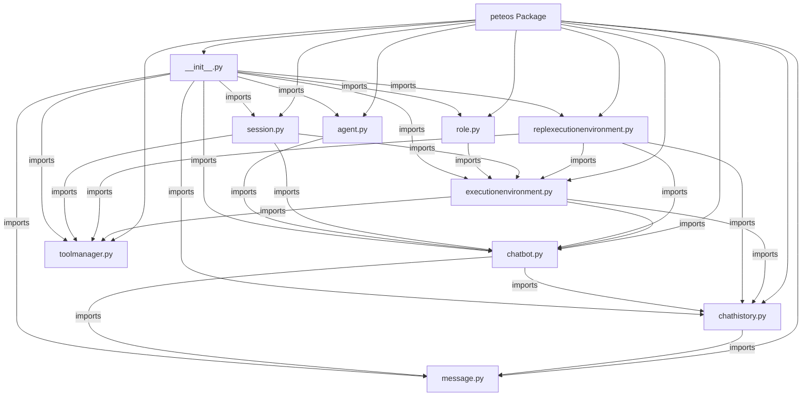

# Peteos Architecture

## Initial Architecture (2026-03-27)

### Overview
Project now includes Message, ChatHistory, ToolManager, ExecutionEnvironment, Session, Role, Agent, HTTPClient, ChatBot (abstract), ChatBotResponse (abstract), OpenAIChatBot, AnthropicChatBot, and REPLExecutionEnvironment classes.

### Structure
```
peteos/
├── __init__.py
├── agent.py
├── chatbot.py
├── chatbotresponse.py
├── message.py
├── chathistory.py
├── toolmanager.py
├── executionenvironment.py
├── httpclient.py
├── replexecutionenvironment.py
├── session.py
├── role.py
```

### Components
- **Message**: Represents a single message with content and timestamp
- **ChatHistory**: Container for a list of Message objects

  - Methods: `get_content()` - returns list of message content dictionaries
  - Methods: `append_message(Message)` - appends message to history
- **Tool**: Represents a tool with properties

  - Attributes: `name` (str), `description` (str), `func` (Callable), `parameters` (dict)
  - Class Methods: `from_callable(Callable)` - creates Tool from callable, extracts name/description/parameters
  - Methods: `__call__(**kwargs)` - invokes the tool

- **ToolManager**: Manages tools for the execution environment

  - Contains: dictionary of registered tools
  - Methods: `register_tool(...)` - registers tools (accepts Tool instance or Callable with metadata)
  - Methods: `get_tool(name: str)` - retrieves tool by name

- **HTTPClient**: Async HTTP client for LLM API communication

  - Methods: `stream_post(url, body)` - async generator yielding raw SSE lines
  - Methods: `post(url, body)` - returns parsed JSON dict (non-streaming)

- **ChatBot** (abstract): Abstract base class for LLM chatbot implementations

  - Contains: `HTTPClient`, `model` (str)
  - Methods: `send_message(ChatHistory, streaming=True)` (async) - returns ChatBotResponse
  - Methods: `list_available_models()` - lists available models
  - Property: `model` - getter and setter for model identifier
  - Subclasses: `OpenAIChatBot`, `AnthropicChatBot`

- **ChatBotResponse** (abstract): Abstract base class for LLM responses with streaming support

  - Contains: `_stream` (raw SSE generator), `_data` (dict)
  - Async iterable: yields (key, chunk) tuples
  - Properties: `data` - accumulated response fields
  - Subclasses: `OpenAIChatBotResponse`, `AnthropicChatBotResponse`
  - Translation: normalizes `reasoning`/`thinking` to `reasoning`, `content`/`text` to `text`

- **ExecutionEnvironment**: Abstract base class for agent execution environments

  - Contains: `ChatHistory`, `ToolManager`, `ChatBot`
  - Methods: `set_interrupt()` - request interrupt, `clear_interrupt()` - clear interrupt, `is_running` - check if running, `get_chat_history()` - returns ChatHistory
  - Abstract Methods: `run()` - runs agentic loop until LLM responds with final answer or interrupted (must be overridden)

- **REPLExecutionEnvironment**: Concrete implementation of ExecutionEnvironment for REPL

  - Inherits from: `ExecutionEnvironment`
  - Methods: `run()` - REPL loop that processes chat history via chatbot, appends output to ChatHistory

- **Session**: Container for execution environment

  - Contains: `Role`, `ExecutionEnvironment`, `ChatHistory`, `uuid` (UUID)
  - Creates `ChatHistory` locally if None provided in constructor
  - Generates `uuid` locally if None provided in constructor
  - Passes `ChatHistory` and `ChatBot` to `ExecutionEnvironment` constructor
  - Static Methods: `load_from_string(str)`, `load_from_file(str)` - UUID set from loaded data

- **Role**: Represents a role with identity and context

  - Attributes: `name` (str), `description` (str), `system_prompt` (Optional[str])
  - Static Methods: `load_from_dict(dict)` - loads from dict with name, description, system_prompt keys
  - Static Methods: `load_from_path(str)` - loads from directory with description.md and optional system_prompt.md

- **Agent**: Manages concurrent sessions

  - Contains: `ChatBot`, session dict, channel dict
  - Each session runs in its own thread
  - Manages channels to sessions
  - Passes `ChatBot` to sessions/executions

### Dependencies
- Python >= 3.10
- `httpx` - async HTTP client

### Class Diagram

```mermaid
classDiagram
    class Message {
        +dict content
        +datetime creation_timestamp
        +str id
        +__init__(content: dict, creation_timestamp: datetime=None, message_id: str=None)
    }

    class ChatHistory {
        +List[Message] messages
        +__init__()
        +get_content() List[dict]
        +append_message(message: Message)
    }

    class Tool {
        +str name
        +str description
        +Callable func
        +dict parameters
        +from_callable(func: Callable) Tool
        +__call__(**kwargs) Any
    }

    class ToolManager {
        +Dict[str, Tool] _tools
        +__init__()
        +register_tool(tool: Tool=None, name: str=None, description: str=None, parameters: dict=None, func: Callable=None)
        +get_tool(name: str) Tool
    }

    class HTTPClient {
        +__init__(timeout: float)
        +stream_post(url: str, body: dict) AsyncGenerator[str]
        +post(url: str, body: dict) dict
    }

    class ChatBot {
        <<Abstract>>
        +HTTPClient _http_client
        +str _model
        +__init__(http_client: HTTPClient, model: str)
        +send_message(chat_history: ChatHistory, streaming: bool=True) ChatBotResponse
        +list_available_models() list[str]
        +model str {get; set}
    }

    class OpenAIChatBot {
        +str _base_url
        +__init__(http_client: HTTPClient, model: str, base_url: str)
        +send_message(chat_history: ChatHistory, streaming: bool=True) OpenAIChatBotResponse
        +list_available_models() list[str]
    }

    class AnthropicChatBot {
        +str _base_url
        +__init__(http_client: HTTPClient, model: str, base_url: str)
        +send_message(chat_history: ChatHistory, streaming: bool=True) AnthropicChatBotResponse
        +list_available_models() list[str]
    }

    class ChatBotResponse {
        <<Abstract>>
        +AsyncGenerator _stream
        +Dict[str, Any] _data
        +__init__(stream: AsyncGenerator)
        +__aiter__()
        +__getitem__(key: str) Any
        +data Dict[str, Any] {get}
    }

    class OpenAIChatBotResponse {
        +_translate_event(event: dict) dict
        +_accumulate_content(event: dict)
    }

    class AnthropicChatBotResponse {
        +_translate_event(event: dict) dict
        +_accumulate_content(event: dict)
    }

    class ExecutionEnvironment {
        +ToolManager tool_manager
        +ChatHistory chat_history
        +ChatBot chatbot
        +bool _interrupt
        +bool _running
        +__init__(chatbot: ChatBot, chat_history: ChatHistory, tool_manager: ToolManager)
        +is_running bool {get}
        +set_interrupt()
        +clear_interrupt()
        +get_chat_history() ChatHistory
        +run() #abstract
    }

    class REPLExecutionEnvironment {
        +__init__(chatbot: ChatBot, chat_history: ChatHistory, tool_manager: ToolManager)
        +run()
    }

    class Session {
        +Role role
        +ExecutionEnvironment execution_environment
        +ChatHistory chat_history
        +uuid UUID
        +__init__(role: Role, tool_manager: ToolManager, chatbot: ChatBot, chat_history: ChatHistory=None, session_uuid: UUID=None)
        +load_from_string(data: str) Session
        +load_from_file(file_path: str) Session
    }

    class Role {
        +str name
        +str description
        +str system_prompt
        +__init__(name: str, description: str, system_prompt: str=None)
        +load_from_dict(data: dict) Role
        +load_from_path(path: str) Role
    }

    class Agent {
        +ChatBot _chatbot
        +Dict[str, Session] _sessions
        +Dict[str, object] _channels
        +__init__(chatbot: ChatBot)
    }

    ExecutionEnvironment <|-- REPLExecutionEnvironment
    ChatBot <|-- OpenAIChatBot
    ChatBot <|-- AnthropicChatBot
    ChatBotResponse <|-- OpenAIChatBotResponse
    ChatBotResponse <|-- AnthropicChatBotResponse
    ChatHistory --> Message : contains
    ExecutionEnvironment --> ChatHistory : has
    ExecutionEnvironment --> ToolManager : has
    ExecutionEnvironment --> ChatBot : has
    Session --> ExecutionEnvironment : has
    Session --> ChatHistory : has
    Session --> Role : has
    Session --> ChatBot : has
    Agent --> Session : manages
    Agent --> ChatBot : has
    ChatBot --> HTTPClient : uses
    ChatBot --> ChatHistory : accepts
    ChatBot --> ChatBotResponse : returns
    ChatBotResponse --> AsyncGenerator : consumes
```

### Architecture Diagram

