# Peteos Classes

## Class Diagram

```mermaid
classDiagram
    class Message {
        +dict content
        +datetime creation_timestamp
        +str id
        +__init__(content: dict, creation_timestamp: datetime=None, message_id: str=None)
    }

    class ChatHistory {
        +List[Message] messages
        +__init__()
        +get_content() List[dict]
        +append_message(message: Message)
    }

    class Tool {
        +str name
        +str description
        +Callable func
        +dict parameters
        +from_callable(func: Callable) Tool
        +__call__(**kwargs) Any
        +execute(**kwargs) Any
        +_extract_parameters(func: Callable) dict static
    }

    class ToolManager {
        +Dict[str, Tool] _tools
        +__init__()
        +register_tool(...)
        +get_tool(name: str) Tool
    }

    class HTTPClient {
        +__init__(timeout: float)
        +stream_post(url: str, body: dict) AsyncGenerator[str]
        +post(url: str, body: dict) dict
    }

    class ChatBot {
        <<Abstract>>
        +HTTPClient _http_client
        +str _model
        +__init__(http_client: HTTPClient, model: str)
        +send_message(chat_history: ChatHistory, streaming: bool=True) ChatBotResponse
        +list_available_models() list[str]
        +model str
    }

    class GenericChatBot {
        +str _base_url
        +str _chat_endpoint
        +str _models_endpoint
        +Dict[str, str] _translations
        +Dict[str, str] _request_translations
        +Dict _defaults
        +__init__(http_client, model, base_url, chat_endpoint, models_endpoint, response_translations, request_translations, **defaults)
        +send_message(chat_history, streaming) ChatBotResponse
        +list_available_models() list[str]
        +_build_body(chat_history, streaming) dict
        +_translate_message_fields(msg_data) dict
    }

    class OpenAIChatBot {
        +__init__(http_client, model, base_url)
        +RESPONSE_TRANSLATIONS dict static
        +REQUEST_TRANSLATIONS dict static
    }

    class AnthropicChatBot {
        +__init__(http_client, model, base_url, max_tokens=4096)
        +RESPONSE_TRANSLATIONS dict static
        +REQUEST_TRANSLATIONS dict static
        +_max_tokens
        +send_message(chat_history, streaming, **kwargs) ChatBotResponse
        +_build_body(chat_history, streaming) dict
    }

    class ChatBotResponse {
        <<Abstract>>
        +AsyncGenerator _stream
        +Dict[str, Any] _data
        +__init__(stream: AsyncGenerator)
        +data Dict[str, Any]
        +__getitem__(key: str) Any
        +__contains__(key: str) bool
    }

    class GenericChatBotResponse {
        +Dict[str, str] _translations
        +__init__(stream, translations)
        +from_json(data, translations) static
        +_accumulate_event(event)
        +_event_generator() AsyncIterator[tuple]
        +_process_event(event) dict
        +_translate_event(event) dict
    }

    class AnthropicChatBotResponse {
        +__init__(stream, translations)
        +_process_event(event) dict
    }

    class BackendInfo {
        <<dataclass>>
        +str name
        +str url
        +str api_type
        +Dict[str, Any] models
    }

    class ChatBotManager {
        +Dict[str, BackendInfo] _backends
        +HTTPClient _http_client
        +__init__()
        +async add_backend(name: str, url: str) BackendInfo
        +remove_backend(name: str) bool
        +list_chatbots(model_regex: str) List[Tuple[str, ChatBot]]
        +async load_from_json(json_obj: dict)
        +async load_from_file(filepath: str)
    }

    class ExecutionEnvironment {
        <<Abstract>>
        +ChatBotManager chatbot_manager
        +ChatHistory chat_history
        +ToolManager tool_manager
        +Role role
        +ChatBot _chatbot
        +bool _interrupt
        +asyncio.Event _completion_signal
        +__init__(chatbot_manager: ChatBotManager, chat_history: ChatHistory, tool_manager: ToolManager, role: Role)
        +is_running bool
        +chatbot ChatBot
        +set_interrupt()
        +clear_interrupt()
        +get_chat_history() ChatHistory
        +run()
        +_run_impl() #abstract
        +wait_for_stop()
        +_select_chatbot() ChatBot
    }

    class REPLExecutionEnvironment {
        +__init__(chatbot_manager: ChatBotManager, chat_history: ChatHistory, tool_manager: ToolManager, role: Role)
        +_run_impl()
    }

    class Session {
        +UUID uuid
        +Role role
        +ChatBotManager chatbot_manager
        +ChatHistory chat_history
        +ExecutionEnvironment execution_environment
        +deque[Message] _message_queue
        +asyncio.Lock _queue_lock
        +__init__(role: Role, tool_manager: ToolManager, chatbot_manager: ChatBotManager, chat_history: ChatHistory=None, session_uuid: UUID=None, execution_environment: REPLExecutionEnvironment=None)
        +load_from_json(data: dict, chatbot_manager, role_manager, tool_manager) static
        +load_from_file(file_path: str, chatbot_manager, role_manager, tool_manager) static
        +queue_message(message: Message) async
    }

    class Role {
        +str name
        +str description
        +Optional[str] system_prompt
        +list[str] required_tools
        +str execution_environment
        +str model
        +__init__(name: str, description: str, system_prompt: Optional[str]=None, required_tools: list[str]=None, execution_environment: str="REPL", model: str=".*")
        +load_from_dict(data: dict) static
        +load_from_path(path: str) static
        +load_config_from_path(role_path: str) static
    }

    class RoleManager {
        +Dict[str, Role] _roles
        +__init__()
        +register_role(role: Role)
        +load_from_dir(directory: str) List[str]
        +get_role(name: str) Role
        +list_roles() List[Tuple]
    }

    class Agent {
        +ChatBot _chatbot
        +Dict[str, Session] _sessions
        +Dict[str, object] _channels
        +__init__(chatbot: ChatBot)
    }

    class Message {
        <<Immutable>>
    }

    ExecutionEnvironment <|-- REPLExecutionEnvironment
    ChatBot <|-- GenericChatBot
    GenericChatBot <|-- OpenAIChatBot
    GenericChatBot <|-- AnthropicChatBot
    ChatBotResponse <|-- GenericChatBotResponse
    GenericChatBotResponse <|-- AnthropicChatBotResponse
    ChatHistory --> Message : contains
    ExecutionEnvironment --> ChatHistory : has
    ExecutionEnvironment --> ToolManager : has
    ExecutionEnvironment --> ChatBotManager : has
    ExecutionEnvironment --> Role : has
    ExecutionEnvironment --> ChatBot : has
    Session --> ExecutionEnvironment : has
    Session --> ChatHistory : has
    Session --> Role : has
    Session --> ChatBot : has
    Session --> ToolManager : has
    Session --> ChatBotManager : has
    Session --> RoleManager : has
    Agent --> Session : manages
    Agent --> ChatBot : has
    RoleManager --> Role : manages
    ToolManager --> Tool : has/contains
    ChatBot --> HTTPClient : uses
    ChatBot --> ChatHistory : accepts
    ChatBot --> ChatBotResponse : returns
    ChatBotResponse --> AsyncGenerator : consumes
    ChatHistory --> Message : contains
    ChatBotManager --> BackendInfo : contains
    ChatBotManager --> ChatBot : creates
```



## ChatBotManager API Reference

```python
class ChatBotManager:
    def __init__()
        """Initialize empty manager."""

    async def add_backend(name: str, url: str) -> BackendInfo
        """Add backend, detect API type, discover models."""

    def remove_backend(name: str) -> bool
        """Remove backend by name."""

    def list_chatbots(model_regex: str) -> List[Tuple[str, Any]]
        """List all ChatBots matching regex pattern."""

    async def load_from_json(json_obj: dict) -> None
        """Load backends from JSON object (API auto-detected). Clears current state first."""

    async def load_from_file(filepath: str) -> None
        """Load backends from JSON file (async)."""

@dataclass
class BackendInfo:
    name: str
    url: str
    api_type: str  # "openai" or "anthropic"
    models: Dict[str, Any]  # model_id -> ChatBot instance
```
