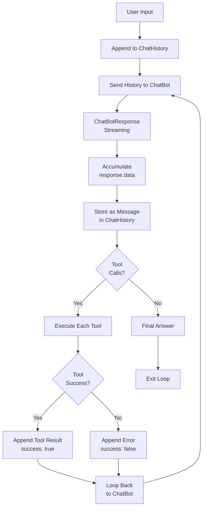

# Execution Environment

## Overview

The Execution Environment provides the runtime context for agent interactions. It encapsulates the agentic loop that sends chat history to the LLM, processes responses, and maintains conversation state.

## Architecture

```
┌────────────────────────────────────────────────────────────┐
│                        Agent                               │
│              (manages concurrent sessions)                 │
└───────────────────────┬────────────────────────────────────┘
                        │
                        ▼
┌────────────────────────────────────────────────────────────┐
│                        Session                             │
│  ┌──────────────┐  ┌──────────────────┐  ┌──────────────┐  │
│  │     Role     │  │  ChatHistory     │  │    UUID      │  │
│  └──────────────┘  └──────────────────┘  └──────────────┘  │
│                           │                                │
│              ┌────────────▼───────────┐                    │
│              │  ExecutionEnvironment  │                    │
│              │  ┌──────────────────┐  │                    │
│              │  │    ChatBot       │  │                    │
│              │  ├──────────────────┤  │                    │
│              │  │  ToolManager     │  │                    │
│              │  └──────────────────┘  │                    │
│              └────────────────────────┘                    │
└────────────────────────────────────────────────────────────┘
```

## Components

### ChatBot

Communicates with the LLM API. Handles:
- Building request bodies from chat history
- Sending requests (streaming or non-streaming)
- Returning `ChatBotResponse` objects

**Key Methods:**
- `send_message(chat_history, streaming=True)` - sends request, returns response
- `list_available_models()` - lists available models

### ChatBotResponse

Streams LLM responses with support for:
- Server-Sent Events (SSE) parsing
- Accumulating all response fields into `response.data` dict
- Path-based translation of API-specific schemas
- Async iteration yielding `(key, chunk)` tuples

**Key Properties:**
- `response.data["text"]` - accumulated response text
- `response.data["reasoning"]` - accumulated reasoning/thinking content
- `response.data["tool_calls"]` - list of tool call dicts (pre-parsed)
- `response.data["role"]` - accumulated role field (if present)

### ToolManager

Registers and executes tools (functions) available to the agent:
- `register_tool(tool)` - register a `Tool` instance or callable
- `get_tool(name)` - retrieve tool by name
- `execute(**args)` - invoke tool with arguments

### ChatHistory

Container for conversation messages:
- `append_message(message)` - add message
- `get_content()` - extract message contents for API

## REPLExecutionEnvironment

The `REPLExecutionEnvironment` implements the core agentic loop. It's a "Read-Eval-Print Loop" for agent interactions with tool use support.

### Design Principles

1. **Streaming-First**: Processes LLM responses as they stream in
2. **Tool-Use Support**: Automatically detects and executes tool calls
3. **Stateful**: Maintains conversation history throughout the loop
4. **Interruptible**: Can be terminated gracefully from other threads
5. **Response Accumulation**: Accumulates complete response before appending to history

### The REPL Loop

The REPLExecutionEnvironment implements a stateful agentic loop:

1. **Request**: Sends accumulated chat history to the LLM via ChatBot (streaming mode)
2. **Accumulate**: Collects the complete response, accumulating all fields (text, reasoning, tool_calls) into `response.data`
3. **Store**: Appends the full `response.data` dict as a single Message to ChatHistory
4. **Check Tools**: If `response.data` contains `tool_calls`:
   - Execute each tool via ToolManager
   - Append tool result with `success` field (True/False)
   - **Loop continues** with updated history
5. **Exit**: If no tool calls, the response is the final answer - loop terminates

The loop handles interrupts gracefully via the `_interrupt` flag, which can be set from any thread.

### Tool Call Format

Tool calls come pre-parsed in `response.data["tool_calls"]` as a list of dicts:

```python
tool_calls = response.data.get("tool_calls")
# [
#   {"name": "get_weather", "arguments": {"city": "London"}},
#   {"name": "search", "arguments": {"query": "weather"}}
# ]
```

The API is responsible for returning tool calls in this structured format. The response parser extracts tool_calls from the JSON response and makes them available directly.

### Tool Response Format

Tool results appended to chat history include a `success` field:

```python
# Successful tool execution
Message(content={
    "role": "tool",
    "name": "get_weather",
    "content": "Sunny in London",
    "success": True
})

# Failed tool execution
Message(content={
    "role": "tool",
    "name": "get_weather",
    "content": "Error: TypeError: 'NoneType' object is not subscriptable",
    "success": False
})

# Tool not found
Message(content={
    "role": "tool",
    "name": "unknown_tool",
    "content": "Error: Tool 'unknown_tool' not found",
    "success": False
})
```

### Interrupt Control

Thread-safe interrupt mechanism for graceful shutdown:

```python
# Request termination from any thread
env.set_interrupt()

# Check and clear
env.clear_interrupt()

# Check running state
env.is_running  # Returns True while run() is executing
```

**Usage Pattern:**
```python
async def run_with_timeout(env, timeout_seconds):
    import asyncio

    # Set timeout interrupt
    async def timeout_handler():
        await asyncio.sleep(timeout_seconds)
        env.set_interrupt()

    await asyncio.gather(
        env.run(),
        timeout_handler()
    )
```

## Message Format

Messages stored in ChatHistory contain the full `response.data` dict:

```python
# Assistant response with reasoning and tool_calls
Message(content={
    "role": "assistant",
    "text": "The weather in London is sunny.",
    "reasoning": "I need to call get_weather to find the current conditions...",
    "tool_calls": [
        {"name": "get_weather", "arguments": {"city": "London"}}
    ]
})

# Tool result
Message(content={
    "role": "tool",
    "name": "get_weather",
    "content": "Sunny in London",
    "success": True
})
```

## Message Flow



## Usage Example

```python
from peteos.chatbot import OpenAIChatBot
from peteos.replexecutionenvironment import REPLExecutionEnvironment
from peteos.toolmanager import ToolManager
from peteos.chathistory import ChatHistory
from peteos.httpclient import HTTPClient
from peteos.role import Role

# Setup
http_client = HTTPClient(timeout=60.0)
chatbot = OpenAIChatBot(
    http_client=http_client,
    model="qwen3.5-35b",
    base_url="http://localhost:8000"
)
tool_manager = ToolManager()
chat_history = ChatHistory()

# Register tools
@tool_manager.register_tool
def get_weather(city: str) -> str:
    """Get weather for a city."""
    return f"Sunny in {city}"

# Create execution environment
env = REPLExecutionEnvironment(
    chatbot=chatbot,
    chat_history=chat_history,
    tool_manager=tool_manager
)

# Run the agentic loop
async def main():
    await env.run()

asyncio.run(main())
```

## Testing

Unit tests for `REPLExecutionEnvironment` cover:
- Basic conversation flow
- Tool call detection and execution
- Loop continuation on tool calls
- Loop termination on final answer
- Interrupt handling
- Thinking content accumulation

Run tests:
```bash
pytest tests/unit/test_replexecutionenvironment.py -v
```

## Design Rationale

### Why Stream Processing?

Streaming allows:
- Real-time feedback to users
- Early response parsing
- Lower latency perception
- Ability to interrupt mid-stream

### Why Pre-Parsed Tool Calls?

Tool calls come pre-parsed in `response.data["tool_calls"]`:
- API response parsing handles JSON extraction
- REPL doesn't need to parse text for embedded JSON
- Consistent format across all responses
- Eliminates need for `_parse_tool_calls_from_text()`

### Why Accumulate Response First?

Accumulating `ChatBotResponse` before processing:
- All fields available in `response.data` dict
- Supports multi-field events (reasoning + tool_calls)
- Clean separation between streaming and processing
- Works with both streaming and non-streaming modes

### Why Separate Thinking Content?

Separating thinking from response text:
- Enables transparent reasoning display
- Useful for debugging/auditing
- Allows different handling of reasoning vs. answers
- Supports models with explicit thinking phases

### Why Success Field in Tool Responses?

The `success` field in tool responses:
- Enables downstream processing to distinguish errors from tool output
- Helps the LLM understand when a tool failed vs. returned invalid data
- Supports debugging and logging of tool execution
