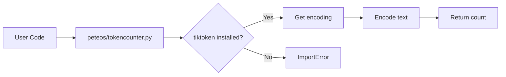

# Token Counter

## Overview
The token counter module provides utilities for counting tokens in text using tiktoken, OpenAI's tokenization library.

## Components

### `count_tiktoken()` Function
Location: `peteos/utils/tiktoken.py`

Count tokens in a string using tiktoken.

**Signature:**
```python
def count_tiktoken(text: str, encoding: str = "cl100k_base") -> int
```

**Parameters:**
- `text` (str): The text to count tokens for
- `encoding` (str): The tiktoken encoding to use (default: `cl100k_base`)

**Returns:**
- `int`: The token count

**Raises:**
- `ImportError`: If tiktoken is not installed
- `ValueError`: If the encoding is not recognized

**Usage:**
```python
from peteos.tokencounter import count_tiktoken

# Count tokens with default encoding
count = count_tiktoken("Hello world")  # Returns ~3-4 tokens

# Count tokens with custom encoding
count = count_tiktoken("Hello world", encoding="p50k_base")
```

## Dependencies

tiktoken is an optional dependency. Install with:
```bash
pip install peteos[tiktoken]
```

## Architecture Diagram



## Implementation Details

- Uses tiktoken's `get_encoding()` to retrieve the tokenizer
- Encodes text and returns the length of the token list
- Default encoding is `cl100k_base` (OpenAI's standard for GPT-4)
- Supports any tiktoken-compatible encoding
