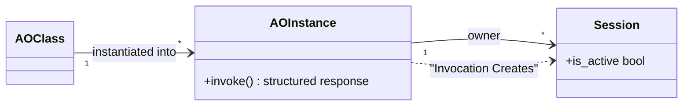
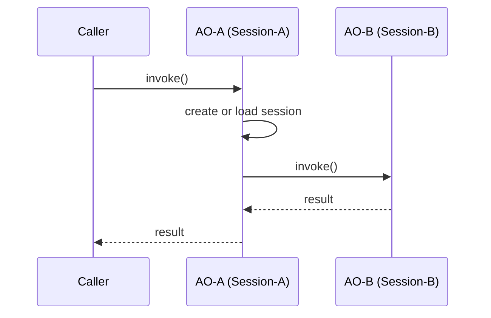

# sOAP Philosophy

sOAP is built on a three-layer model that extends object-oriented programming with agency and persistence.

## The Three Layers

| Layer | Analogy | Role |
|---|---|---|
| **Agentic Class** | OOP class | Blueprint for agentic behavior — system prompt, tools, configuration |
| **Agentic Object** | OOP object instance | A living instance of the class with its own internal state |
| **Session** | Persistent conversation thread | An independent conversation context tied to a single agentic object |

This is OOP extended to three levels rather than the usual two. Agentic classes and agentic objects are regular OOP classes and objects — references between agentic objects work just like references between any other objects in your codebase.

### Agentic Objects

Agentic objects are created by instantiating an agentic class. A single agentic class can have many agentic object instances, just like any regular OOP class. Each agentic object carries its own state and agency.

### Sessions

Just as classes are instantiated into objects, objects are invoked into sessions. Every agentic object can maintain **multiple sessions concurrently**, and sessions are identified by their thread ID (or thread name).

A session belongs exclusively to the agentic object that created it. The same thread ID used on two different agentic objects yields two different sessions — sessions are never shared across agentic objects.

## Invoking Agentic Objects

When you invoke an agentic object, you specify whether to:

- **Create a new session** — a fresh conversation context
- **Reuse an existing session** — load a session by its thread ID

This mirrors the OOP pattern of deciding whether to create a new instance or reuse an existing reference. The invocation determines the session lifecycle; the agentic object manages the rest.

## Call Stacks Across Objects

An agentic object acting within a session can itself invoke other agentic objects — on its own class or on different ones. This creates a **traceback** that spans across multiple objects and sessions, analogous to a call stack in traditional code execution.

Each invocation in the traceback creates or reuses a session on the target agentic object. When sessions are materialized on disk (along with their contexts), the full invocation chain becomes traceable — the chat history can be walked back across object boundaries and session boundaries.

### The No-Circle Restriction

Sessions carry a single responsibility: they must never be invoked concurrently. If an agentic object is already working inside a session, that session is **active**. Invoking an active session would create concurrent access, which is not allowed.

This means the invocation traceback must be **acyclic** with respect to sessions — no session UID may appear more than once along any invocation chain. The implementation enforces this by detecting an attempt to invoke an active session and returning an error to the caller.

## Key Properties

- **Agentic classes and objects are OOP.** References, inheritance, and composition work as you expect.
- **Sessions are tied to agentic objects, not shared.** The same thread ID on different objects yields different sessions.
- **Objects are invoked into sessions.** Just as classes are instantiated into objects, objects are invoked into independent conversation contexts.
- **Multiple sessions per object.** An agentic object can maintain many sessions concurrently.
- **Tracebacks cross objects and sessions.** Invocation chains form call stacks that span agentic objects and their sessions.
- **Sessions are never active concurrently.** The no-circle restriction guarantees at-most-one session invocation per session UID.
